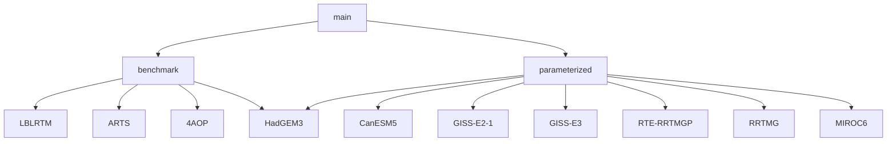

# RFMIP_data_intake
This repo contains an Intake catalog for parameterized and line-by-line radiation models following the RFMIP protocol. The files in this repo form a catalog of the following structure:

